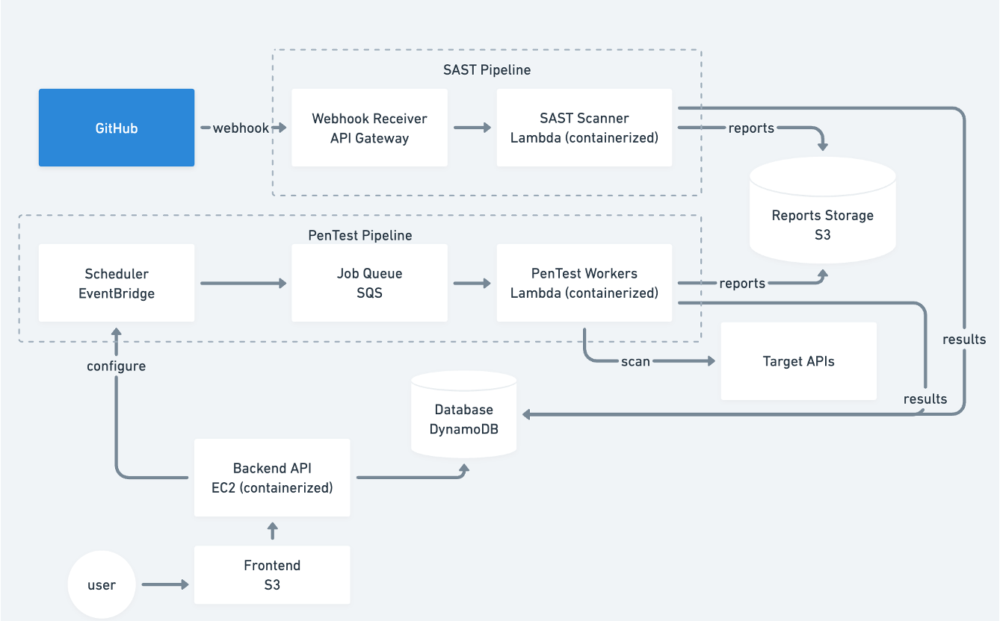

# SecMon — Cloud Security Monitoring Platform

A unified platform for monitoring the security of your codebases and APIs. Combines two independent security pipelines under one dashboard:

- **SAST (Static Application Security Testing)** — scans JavaScript source code on every GitHub push for 10 types of vulnerabilities (hardcoded secrets, SQL/NoSQL injection, XSS, path traversal, weak crypto, etc.)
- **PenTest (Dynamic API Testing)** — runs 6 security tests against live APIs (auth, SQL/NoSQL injection, rate limiting, security headers, sensitive data exposure). Supports on-demand scans and scheduled recurring scans.

Both pipelines write results to a shared data layer (DynamoDB + S3). A single web dashboard lets users trigger scans, browse results, and manage schedules.

---

## Architecture



**In brief:**

- **Frontend:** React app served from S3 static website
- **Backend API:** Express on EC2 — reads/writes DynamoDB, triggers SQS, fetches S3 reports, manages EventBridge schedules
- **SAST Pipeline:** GitHub webhook → API Gateway → containerized Lambda (clones repo + scans) → S3 + DynamoDB
- **PenTest Pipeline:** Frontend or EventBridge → SQS → containerized Lambda (runs tests) → S3 + DynamoDB
- **Shared storage:** DynamoDB (scan metadata) + S3 (full reports)

Everything is deployed with a single Terraform root and one shell script.

---

## Project structure

```
SecMon/
├── frontend/              React app (Vite)
│   ├── src/App.jsx        3-tab navigation (SAST, PenTest, GitHub)
│   ├── src/api/client.js  Centralized API client
│   └── src/pages/         SASTPage, PenTestPage, GitHubPage
├── backend/               Express API (runs on EC2)
│   └── server.js
├── pentest-lambda/        Pentest Lambda (Docker, ARM64)
│   ├── handler.js         SQS → run tests → DynamoDB + S3
│   └── tester.js          6 pentest implementations
├── sast-lambda/           SAST Lambda (Docker, ARM64, needs git)
│   ├── handler.js         Webhook → clone + scan → DynamoDB + S3
│   └── scanner.js         10 vulnerability patterns
├── terraform/             Single Terraform root (all AWS infra)
├── deploy.sh              One-command full deploy
├── deploy-pentest-target.sh  Deploy vulnerable test API on EC2
├── architecture.png       Architecture diagram
├── PROGRESS.md            Detailed merge history and design decisions
└── README.md              This file
```

---

## Prerequisites

- **AWS Learner Lab** session active (or an AWS account with `LabRole` IAM role)
- **AWS CLI** configured (`aws configure` or Learner Lab credentials loaded)
- **Docker Desktop** running (for building Lambda container images)
- **Terraform** ≥ 1.3
- **Node.js** ≥ 20
- **Git**

---

## 1. Deploy to AWS

### 1.1 Configure Terraform variables

Create `terraform/terraform.tfvars`:

```bash
cd terraform
cat > terraform.tfvars <<EOF
lab_role_arn          = "arn:aws:iam::<YOUR_ACCOUNT_ID>:role/LabRole"
github_webhook_secret = "pick-any-random-string"
EOF
cd ..
```

Replace `<YOUR_ACCOUNT_ID>` with your AWS account ID (`aws sts get-caller-identity --query Account --output text`). The webhook secret is any random string — you'll paste the same value into GitHub's webhook settings later.

### 1.2 Run the deploy script

```bash
./deploy.sh
```

This takes ~5-8 minutes and does:

1. Terraform apply (infrastructure only: VPC, DynamoDB, S3, SQS, both ECR repos)
2. Build + push the **pentest** Lambda image to ECR
3. Build + push the **SAST** Lambda image to ECR
4. Terraform apply (full: both Lambdas, API Gateway, EC2 backend, frontend S3 bucket)
5. Build the frontend with the EC2 IP baked in, sync to the frontend S3 bucket

When it finishes, the script prints:

```
Frontend:      http://secmon-frontend.s3-website-us-west-2.amazonaws.com
Backend API:   http://<EC2_IP>:3000
SQS Queue:     https://sqs.us-west-2.amazonaws.com/<account>/secmon-pentest-jobs
SAST Webhook:  https://<id>.execute-api.us-west-2.amazonaws.com/webhook
```

**Open the Frontend URL in your browser.** You should see the SecMon dashboard with three tabs.

---

## 2. Test SAST with `sast-test-repo`

The SAST pipeline scans a GitHub repo every time you push to it. We'll use a public repo with known vulnerabilities: [YueHuang22/sast-test-repo](https://github.com/YueHuang22/sast-test-repo).

### 2.1 Fork the test repo

Fork to your own account (so you can push commits):

```bash
gh repo fork YueHuang22/sast-test-repo --clone=true
```

Or via the GitHub UI: [Fork button](https://github.com/YueHuang22/sast-test-repo/fork).

### 2.2 Register the repo in SecMon

1. In the SecMon dashboard, go to **GitHub Config** tab.
2. In the "Register a Repository" field, enter `<your-github-username>/sast-test-repo` and click **Add**.
3. Copy the **Webhook URL** shown at the top of the page.

### 2.3 Add the webhook to your fork on GitHub

1. Go to `https://github.com/<your-username>/sast-test-repo/settings/hooks`
2. Click **Add webhook**
3. Fill in:
   - **Payload URL:** the webhook URL from the GitHub Config tab
   - **Content type:** `application/json`
   - **Secret:** the same value you put in `github_webhook_secret` in `terraform.tfvars`
   - **Which events:** "Just the push event"
   - **Active:** checked
4. Click **Add webhook**

GitHub will immediately send a "ping" event. It should show a green checkmark under "Recent Deliveries" — this also marks your repo as `connected` in the dashboard.

### 2.4 Trigger a scan

Push any commit to the fork:

```bash
cd sast-test-repo
echo "// trigger scan $(date)" >> README.md
git commit -am "trigger SAST"
git push
```

Within ~30 seconds:
- **GitHub → Webhooks → Recent Deliveries** shows `200 OK`
- **SecMon → SAST Scans tab** shows a new scan row with H/M/L severity counts
- Click the row to see the full vulnerability list (line numbers, file paths, severity)

If anything fails, check Lambda logs:
```bash
aws logs tail /aws/lambda/secmon-sast-scanner --follow --region us-west-2
```

---

## 3. Test PenTest with a vulnerable target

The pentest pipeline runs 6 security tests against a target URL. We'll deploy a deliberately vulnerable API on a separate EC2 instance to scan against.

### 3.1 Deploy the pentest target

```bash
./deploy-pentest-target.sh
```

This launches a separate `t2.micro` EC2 running `test-target.js` on port 4000. It prints the target URL when done:

```
Public IP:    <TARGET_IP>
Test Target:  http://<TARGET_IP>:4000
```

Wait ~60 seconds for it to fully boot, then verify:
```bash
curl http://<TARGET_IP>:4000/health
# {"status":"running","message":"Vulnerable test target is running"}
```

### 3.2 Run a manual scan

1. In the SecMon dashboard, go to **Pen Tests** tab.
2. Click **New Scan**.
3. Enter target URL: `http://<TARGET_IP>:4000/api/users`
4. Click **Scan**.

Within ~15 seconds, a new scan appears in the Manual Scans list showing the summary (e.g. "2 pass, 3 fail, 1 warn"). Click it to see individual test results:

| Test | Expected Result |
|------|-----------------|
| Authentication | WARN (no auth required) |
| SQL Injection | PASS |
| NoSQL Injection | PASS |
| Rate Limiting | FAIL (no rate limiting) |
| Security Headers | FAIL (missing CSP, HSTS, etc.) |
| Data Exposure | FAIL (exposes passwords, secrets) |

### 3.3 Run a scheduled scan

1. Still on the **Pen Tests** tab, scroll to **Scheduled Scans**.
2. Click **Add Schedule**.
3. Fill in:
   - **Target URL:** `http://<TARGET_IP>:4000/api/users`
   - **Cron expression:** `rate(1 minute)` (for quick testing) or `rate(1 hour)` / `cron(0 2 * * ? *)`
4. Click **Create**.

The schedule appears with status `ACTIVE`. Wait a minute and click the schedule card — you'll see runs accumulating under it. Each run is a separate entry with its own test results.

Click **Delete** on the schedule card to stop it (removes the EventBridge rule).

### 3.4 Other target endpoints to try

The test target has more vulnerable endpoints:

- `http://<TARGET_IP>:4000/api/user?id=1` — triggers SQL injection detection
- `http://<TARGET_IP>:4000/api/login` — triggers auth + NoSQL injection
- `http://<TARGET_IP>:4000/api/data` — triggers data exposure

---

## 4. Tear down

### 4.1 Destroy Terraform resources

```bash
cd terraform
terraform destroy -auto-approve
```

This removes everything created by `deploy.sh` (EC2, Lambdas, DynamoDB, S3 buckets, API Gateway, etc.).

### 4.2 Terminate the pentest target (deployed separately)

```bash
# Find the instance ID
aws ec2 describe-instances --region us-west-2 \
  --filters "Name=tag:Name,Values=secmon-pentest-target" "Name=instance-state-name,Values=running" \
  --query 'Reservations[*].Instances[*].InstanceId' --output text

# Terminate it
aws ec2 terminate-instances --instance-ids <INSTANCE_ID> --region us-west-2
```

### 4.3 Delete any scheduled EventBridge rules created via the UI

The backend deletes the EventBridge rule when you click Delete on a schedule in the UI. If you destroyed Terraform without deleting schedules first, orphaned rules may remain. Find and remove them:

```bash
aws events list-rules --region us-west-2 --name-prefix pentest-schedule- \
  --query 'Rules[*].Name' --output text

# For each rule name returned:
aws events remove-targets --region us-west-2 --rule <RULE_NAME> --ids sqs-target
aws events delete-rule --region us-west-2 --name <RULE_NAME>
```

---

## Troubleshooting

| Problem | Fix |
|---------|-----|
| `terraform apply` fails on Lambda with `image does not exist` | Docker Desktop not running, or ECR push failed. Start Docker and rerun `./deploy.sh` — it's idempotent. |
| SAST webhook returns 401 | Secret mismatch. The value in `terraform.tfvars` must match the Secret field in GitHub webhook settings. |
| SAST Lambda times out | Repo too large. Check `aws logs tail /aws/lambda/secmon-sast-scanner`. Default timeout is 5 min, memory 1 GB. |
| Pentest scan stuck in "queued" | Lambda failed to pick up from SQS. Check `aws logs tail /aws/lambda/secmon-pentest-scanner`. |
| Frontend shows "Loading..." forever | Backend unreachable. The EC2 IP is baked into the frontend at build time; if you redeployed and the IP changed, rebuild + resync: `cd frontend && VITE_API_URL=http://<new-ip>:3000 npm run build && aws s3 sync dist/ s3://secmon-frontend/ --delete` |
| After Learner Lab session resets, nothing works | Run `./deploy.sh` again to rebuild everything from scratch. |
